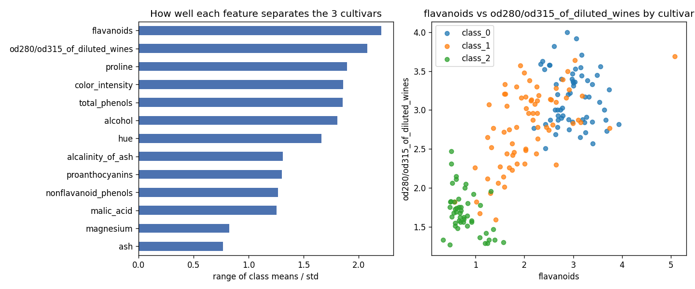

# Day 01 — sklearn `wine` (178 wines · 13 chemical features · 3 cultivars)

**Question:** Which chemical features separate the three cultivars most?

**Method:** For each feature, took the range of the per-cultivar means and divided by the feature's overall std — a quick "separation score". Ranked features, then scattered the top two against each other, coloured by cultivar.

**Insights**
1. **Flavanoids** (2.20) and **OD280/OD315** (2.08) separate the cultivars best — both are phenolic-compound measures, so the cultivars differ mainly in phenolic profile.
2. **Proline**, **color intensity**, **total phenols** and **alcohol** all score ~1.8–1.9 — a second tier that still splits the classes well.
3. **Ash** (0.77) and **magnesium** (0.83) are nearly useless for telling cultivars apart — candidates to drop in a classifier.

**Next question this raises:** How much accuracy does a classifier lose if it uses only the top-2 features vs. all 13?

