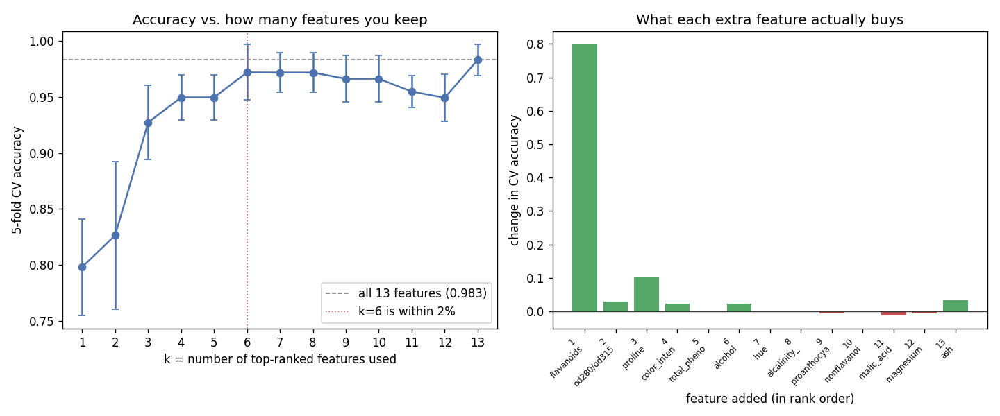

# Day 02 — sklearn `wine` (178 wines · 13 chemical features · 3 cultivars)

**Question:** How much accuracy does a classifier lose using only the top-k features instead of all 13?

**Method:** Reused day-01's separation score to rank the 13 features, then added them one at a time (best first) to a `StandardScaler` + `LogisticRegression` pipeline. Scored each subset with 5-fold stratified CV and plotted the accuracy curve plus the per-feature gain.

**Insights**
1. **The top-2 features are not enough.** Flavanoids + OD280/OD315 give 0.827 CV accuracy vs **0.983** for all 13 — a 15.7-point gap. A high separation score per feature does not mean the pair is jointly sufficient.
2. **Proline is where it jumps.** Adding it third takes accuracy 0.827 → 0.927; color intensity and alcohol carry it to 0.972 by k=6. **Six features get within 2% of the full model** — the cheap model is 6 features, not 2.
3. **The tail is noise, not signal.** Features 9–12 each *cost* accuracy (0.972 → 0.949) before `ash` — day-01's worst feature — restores it at k=13. Swings of that size sit inside the ±0.02 fold std, so ranking-by-separation is a rough guide, not a reliable feature selector.

**Next question this raises:** Does a proper wrapper method (recursive feature elimination) find a better 6-feature subset than the separation-score top 6?

