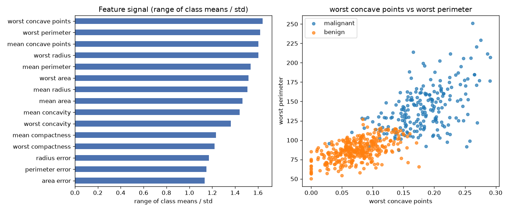

# Day 03 — sklearn `breast_cancer` (569 rows · 30 features)

**Question:** Which features carry the most signal about the target?

**Method:** Scored every numeric feature by range of class means / std, ranked them, and plotted the top two against each other.

**Insights**
1. **worst concave points** carries the most signal (1.64 on range of class means / std), followed by **worst perimeter** (1.62).
2. The top feature is **122× stronger** than the weakest (**symmetry error**, 0.01) — the signal is far from evenly spread.
3. 5 of 30 features (17%) score below a quarter of the leader — the useful signal is spread across a wide middle tier, not just the top few.

**Next question this raises:** Do the top-ranked features stay on top once a model sees them together?

