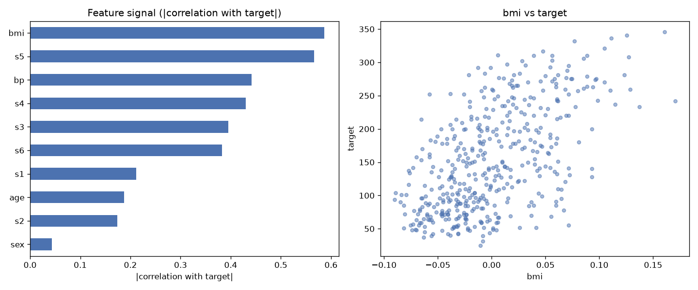

# Day 04 — sklearn `diabetes` (442 rows · 10 features)

**Question:** Which features carry the most signal about the target?

**Method:** Scored every numeric feature by |correlation with target|, ranked them, and plotted the top two against each other.

**Insights**
1. **bmi** carries the most signal (0.59 on |correlation with target|), followed by **s5** (0.57).
2. The top feature is **14× stronger** than the weakest (**sex**, 0.04) — the signal is far from evenly spread.
3. 1 of 10 features (10%) score below a quarter of the leader — the useful signal is spread across a wide middle tier, not just the top few.

**Next question this raises:** Do the top-ranked features stay on top once a model sees them together?

