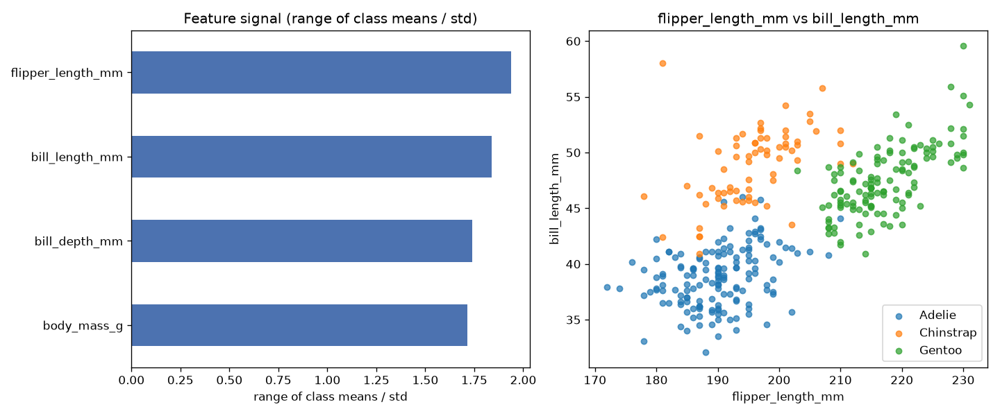

# Day 05 — seaborn `penguins` (344 rows · 6 features)

**Question:** Which features carry the most signal about the target?

**Method:** Scored every numeric feature by range of class means / std, ranked them, and plotted the top two against each other.

**Insights**
1. **flipper_length_mm** carries the most signal (1.94 on range of class means / std), followed by **bill_length_mm** (1.84).
2. The top feature is **1× stronger** than the weakest (**body_mass_g**, 1.72) — the signal is far from evenly spread.
3. 0 of 4 features (0%) score below a quarter of the leader — the useful signal is spread across a wide middle tier, not just the top few.

**Next question this raises:** Do the top-ranked features stay on top once a model sees them together?

