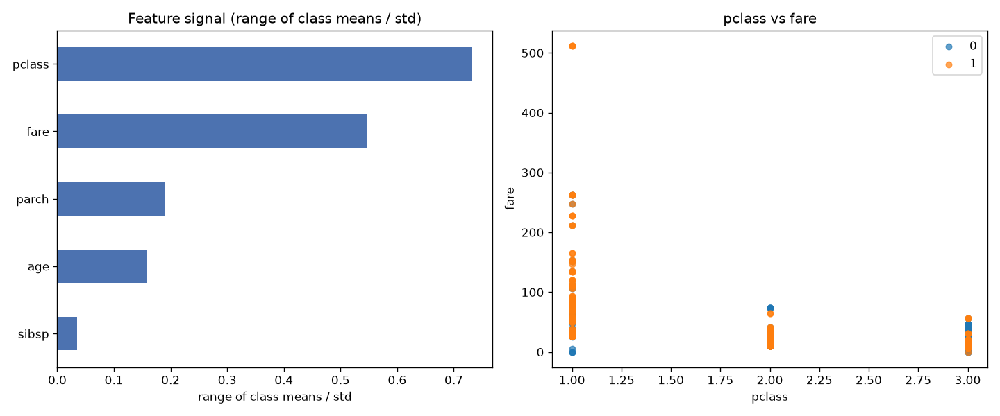

# Day 06 — seaborn `titanic` (891 rows · 10 features)

**Question:** Which features carry the most signal about the target?

**Method:** Scored every numeric feature by range of class means / std, ranked them, and plotted the top two against each other.

**Insights**
1. **pclass** carries the most signal (0.73 on range of class means / std), followed by **fare** (0.55).
2. The top feature is **21× stronger** than the weakest (**sibsp**, 0.04) — the signal is far from evenly spread.
3. 2 of 5 features (40%) score below a quarter of the leader — the useful signal is spread across a wide middle tier, not just the top few.

**Next question this raises:** Do the top-ranked features stay on top once a model sees them together?

