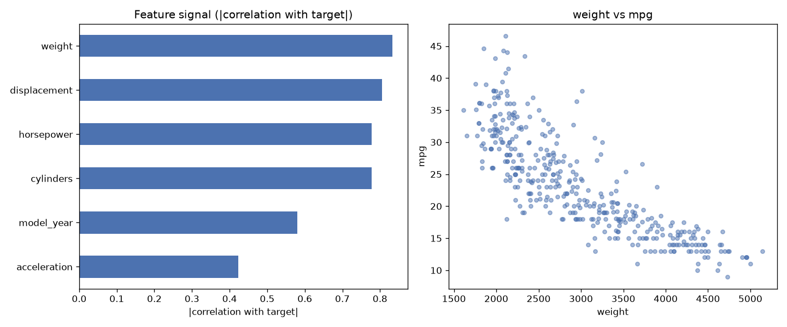

# Day 07 — seaborn `mpg` (398 rows · 8 features)

**Question:** Which features carry the most signal about the target?

**Method:** Scored every numeric feature by |correlation with target|, ranked them, and plotted the top two against each other.

**Insights**
1. **weight** carries the most signal (0.83 on |correlation with target|), followed by **displacement** (0.81).
2. The top feature is **2× stronger** than the weakest (**acceleration**, 0.42) — the signal is far from evenly spread.
3. 0 of 6 features (0%) score below a quarter of the leader — the useful signal is spread across a wide middle tier, not just the top few.

**Next question this raises:** Do the top-ranked features stay on top once a model sees them together?

