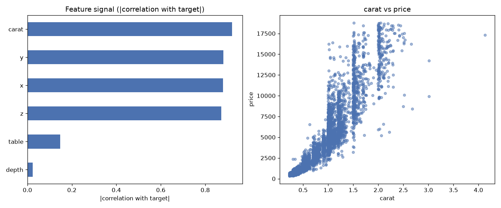

# Day 08 — seaborn `diamonds` (6,000 rows · 9 features)

**Question:** Which features carry the most signal about the target?

**Method:** Scored every numeric feature by |correlation with target|, ranked them, and plotted the top two against each other.

**Insights**
1. **carat** carries the most signal (0.92 on |correlation with target|), followed by **y** (0.88).
2. The top feature is **39× stronger** than the weakest (**depth**, 0.02) — the signal is far from evenly spread.
3. 2 of 6 features (33%) score below a quarter of the leader — the useful signal is spread across a wide middle tier, not just the top few.

**Next question this raises:** Do the top-ranked features stay on top once a model sees them together?

