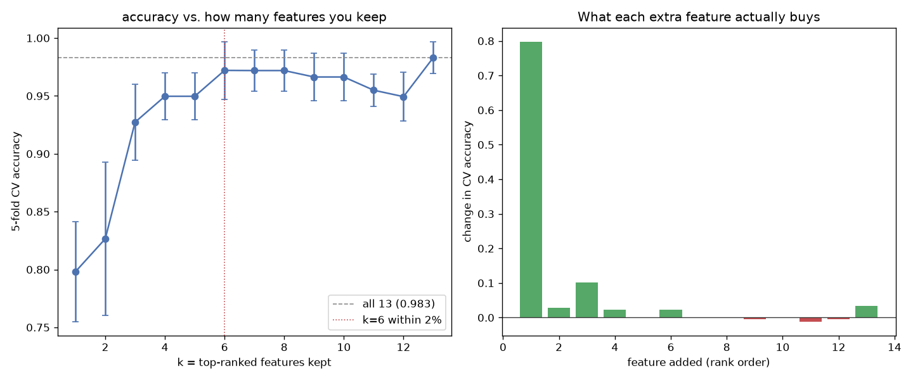

# Day 09 — sklearn `wine` (178 rows · 13 features)

**Question:** How much accuracy do you lose keeping only the top-k features?

**Method:** Ranked features by signal, then added them one at a time to a scaled linear model and scored each subset with 5-fold CV.

**Insights**
1. The single best feature already reaches 0.798 accuracy; all 13 together reach 0.983.
2. **6 features get within 2% of the full model** (0.972) — the other 7 buy almost nothing.
3. 4 of the 12 additions *lowered* CV accuracy, so rank-order-and-add is a rough heuristic, not a feature selector.

**Next question this raises:** Would recursive feature elimination find a better subset of the same size?

