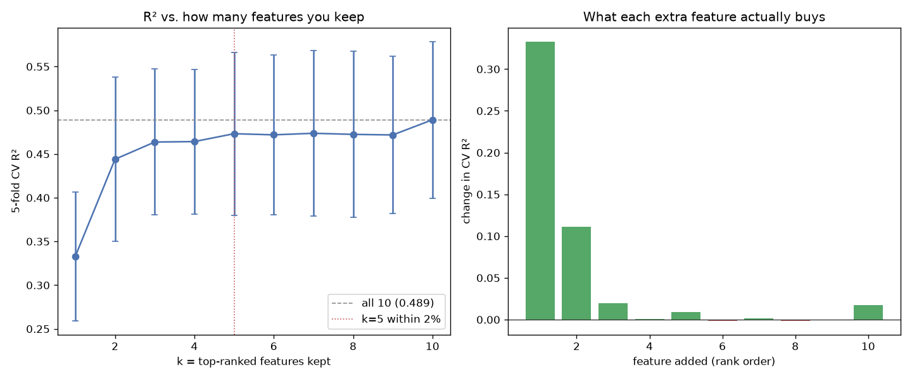

# Day 12 — sklearn `diabetes` (442 rows · 10 features)

**Question:** How much R² do you lose keeping only the top-k features?

**Method:** Ranked features by signal, then added them one at a time to a scaled linear model and scored each subset with 5-fold CV.

**Insights**
1. The single best feature already reaches 0.333 R²; all 10 together reach 0.489.
2. **5 features get within 2% of the full model** (0.473) — the other 5 buy almost nothing.
3. 3 of the 9 additions *lowered* CV R², so rank-order-and-add is a rough heuristic, not a feature selector.

**Next question this raises:** Would recursive feature elimination find a better subset of the same size?

