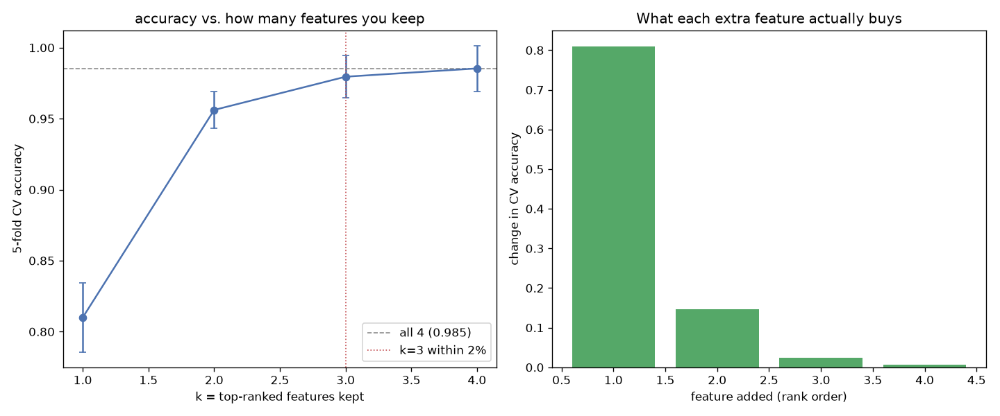

# Day 13 — seaborn `penguins` (344 rows · 6 features)

**Question:** How much accuracy do you lose keeping only the top-k features?

**Method:** Ranked features by signal, then added them one at a time to a scaled linear model and scored each subset with 5-fold CV.

**Insights**
1. The single best feature already reaches 0.810 accuracy; all 4 together reach 0.985.
2. **3 features get within 2% of the full model** (0.980) — the other 1 buy almost nothing.
3. 0 of the 3 additions *lowered* CV accuracy, so rank-order-and-add is a rough heuristic, not a feature selector.

**Next question this raises:** Would recursive feature elimination find a better subset of the same size?

