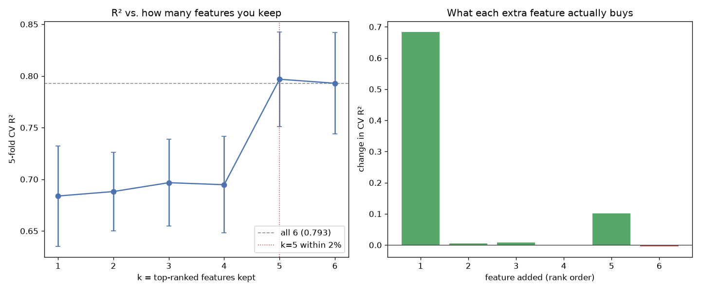

# Day 15 — seaborn `mpg` (398 rows · 8 features)

**Question:** How much R² do you lose keeping only the top-k features?

**Method:** Ranked features by signal, then added them one at a time to a scaled linear model and scored each subset with 5-fold CV.

**Insights**
1. The single best feature already reaches 0.684 R²; all 6 together reach 0.793.
2. **5 features get within 2% of the full model** (0.797) — the other 1 buy almost nothing.
3. 2 of the 5 additions *lowered* CV R², so rank-order-and-add is a rough heuristic, not a feature selector.

**Next question this raises:** Would recursive feature elimination find a better subset of the same size?

