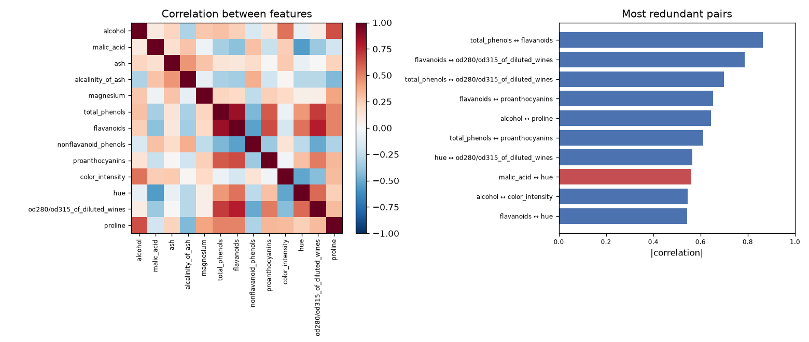

# Day 17 — sklearn `wine` (178 rows · 13 features)

**Question:** Which features are redundant with each other?

**Method:** Computed the full correlation matrix over numeric features and ranked every pair by |r|.

**Insights**
1. **total_phenols** and **flavanoids** are the most redundant pair at |r| = 0.86 (positive) — near-duplicates for a linear model.
2. 1 of 169 feature pairs exceed |r| = 0.8, so the 13 columns hold noticeably fewer than 13 independent dimensions.
3. Typical pair correlation is only |r| = 0.30, meaning the redundancy is concentrated in a few clusters rather than spread across the table.

**Next question this raises:** How many principal components does it take to keep 95% of the variance?

