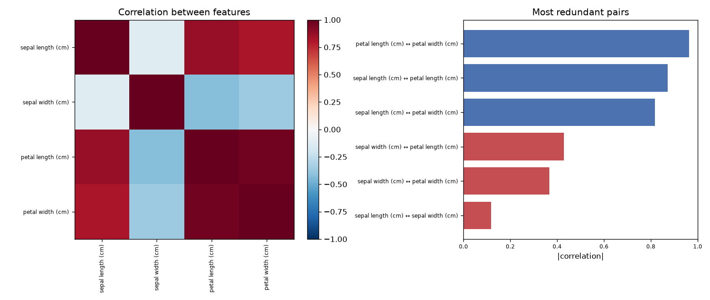

# Day 18 — sklearn `iris` (150 rows · 4 features)

**Question:** Which features are redundant with each other?

**Method:** Computed the full correlation matrix over numeric features and ranked every pair by |r|.

**Insights**
1. **petal length (cm)** and **petal width (cm)** are the most redundant pair at |r| = 0.96 (positive) — near-duplicates for a linear model.
2. 3 of 16 feature pairs exceed |r| = 0.8, so the 4 columns hold noticeably fewer than 4 independent dimensions.
3. Typical pair correlation is only |r| = 0.59, meaning the redundancy is concentrated in a few clusters rather than spread across the table.

**Next question this raises:** How many principal components does it take to keep 95% of the variance?

