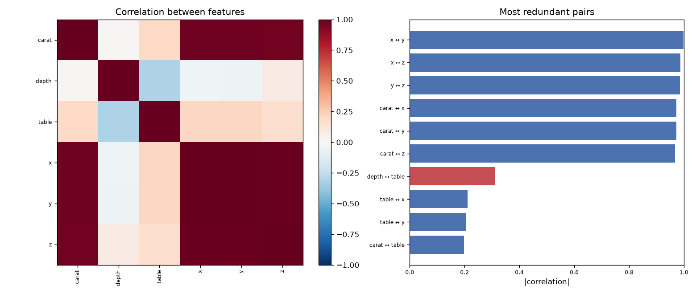

# Day 25 — seaborn `diamonds` (6,000 rows · 9 features)

**Question:** Which features are redundant with each other?

**Method:** Computed the full correlation matrix over numeric features and ranked every pair by |r|.

**Insights**
1. **x** and **y** are the most redundant pair at |r| = 1.00 (positive) — near-duplicates for a linear model.
2. 6 of 36 feature pairs exceed |r| = 0.8, so the 6 columns hold noticeably fewer than 6 independent dimensions.
3. Typical pair correlation is only |r| = 0.48, meaning the redundancy is concentrated in a few clusters rather than spread across the table.

**Next question this raises:** How many principal components does it take to keep 95% of the variance?

