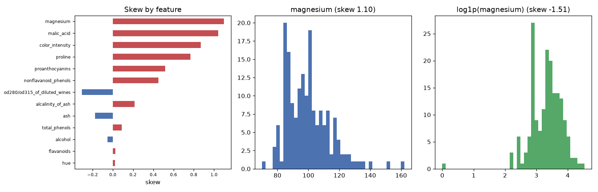

# Day 26 — sklearn `wine` (178 rows · 13 features)

**Question:** How skewed are the features, and does a log transform fix the worst one?

**Method:** Measured skew for every numeric feature, then compared the worst offender's histogram before and after a log1p transform.

**Insights**
1. **magnesium** is the most lopsided feature (skew 1.10); **hue** is the most symmetric (0.02).
2. 2 of 13 features have |skew| > 1 — enough that raw means and std-based scaling are misleading summaries for them.
3. log1p only moves magnesium from 1.10 to -1.51 — the shape is not a simple heavy right tail, so logging is not the fix here.

**Next question this raises:** Does log-transforming the skewed features change which ones a model leans on?

