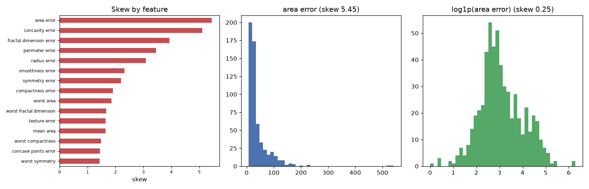

# Day 28 — sklearn `breast_cancer` (569 rows · 30 features)

**Question:** How skewed are the features, and does a log transform fix the worst one?

**Method:** Measured skew for every numeric feature, then compared the worst offender's histogram before and after a log1p transform.

**Insights**
1. **area error** is the most lopsided feature (skew 5.45); **worst smoothness** is the most symmetric (0.42).
2. 22 of 30 features have |skew| > 1 — enough that raw means and std-based scaling are misleading summaries for them.
3. A log1p transform pulls area error from 5.45 to 0.25, so the tail is multiplicative and logging fixes it.

**Next question this raises:** Does log-transforming the skewed features change which ones a model leans on?

