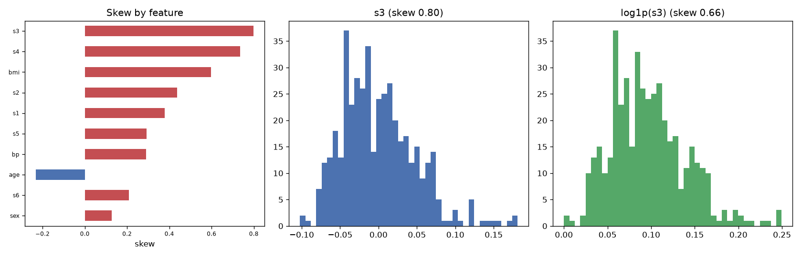

# Day 29 — sklearn `diabetes` (442 rows · 10 features)

**Question:** How skewed are the features, and does a log transform fix the worst one?

**Method:** Measured skew for every numeric feature, then compared the worst offender's histogram before and after a log1p transform.

**Insights**
1. **s3** is the most lopsided feature (skew 0.80); **sex** is the most symmetric (0.13).
2. 0 of 10 features have |skew| > 1 — enough that raw means and std-based scaling are misleading summaries for them.
3. log1p only moves s3 from 0.80 to 0.66 — the shape is not a simple heavy right tail, so logging is not the fix here.

**Next question this raises:** Does log-transforming the skewed features change which ones a model leans on?

