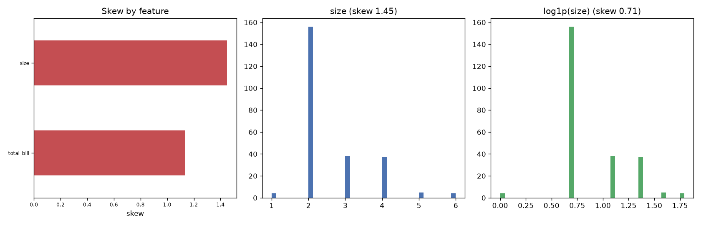

# Day 31 — seaborn `tips` (244 rows · 6 features)

**Question:** How skewed are the features, and does a log transform fix the worst one?

**Method:** Measured skew for every numeric feature, then compared the worst offender's histogram before and after a log1p transform.

**Insights**
1. **size** is the most lopsided feature (skew 1.45); **total_bill** is the most symmetric (1.13).
2. 2 of 2 features have |skew| > 1 — enough that raw means and std-based scaling are misleading summaries for them.
3. A log1p transform pulls size from 1.45 to 0.71, so the tail is multiplicative and logging fixes it.

**Next question this raises:** Does log-transforming the skewed features change which ones a model leans on?

