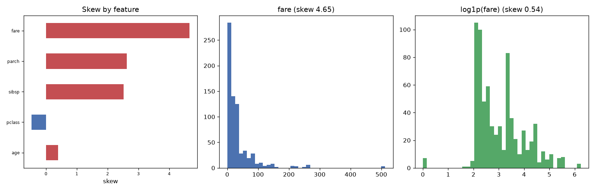

# Day 32 — seaborn `titanic` (891 rows · 10 features)

**Question:** How skewed are the features, and does a log transform fix the worst one?

**Method:** Measured skew for every numeric feature, then compared the worst offender's histogram before and after a log1p transform.

**Insights**
1. **fare** is the most lopsided feature (skew 4.65); **age** is the most symmetric (0.39).
2. 3 of 5 features have |skew| > 1 — enough that raw means and std-based scaling are misleading summaries for them.
3. A log1p transform pulls fare from 4.65 to 0.54, so the tail is multiplicative and logging fixes it.

**Next question this raises:** Does log-transforming the skewed features change which ones a model leans on?

