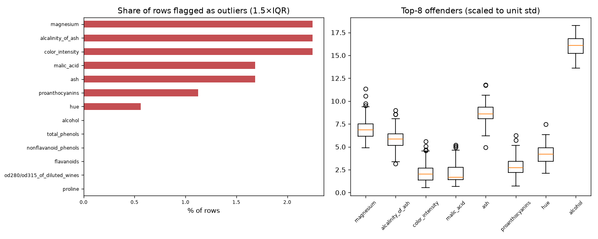

# Day 35 — sklearn `wine` (178 rows · 13 features)

**Question:** Where are the outliers, and how much do they move the summary statistics?

**Method:** Flagged values outside 1.5×IQR per feature, counted the share of affected rows, and recomputed the worst feature's mean with them removed.

**Insights**
1. **magnesium** has the most extreme values — 2.2% of rows fall outside 1.5×IQR.
2. 17 of 178 rows (9.6%) are an outlier on at least one feature, so dropping outlier rows wholesale would cost a large slice of the data.
3. Trimming magnesium's outliers moves its mean by 0.08 std (99.74 → 98.66) — barely anything.

**Next question this raises:** Does a robust scaler beat a standard scaler on this data?

