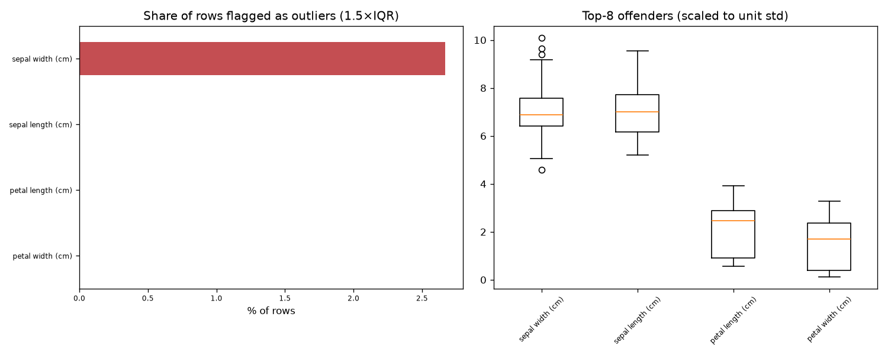

# Day 36 — sklearn `iris` (150 rows · 4 features)

**Question:** Where are the outliers, and how much do they move the summary statistics?

**Method:** Flagged values outside 1.5×IQR per feature, counted the share of affected rows, and recomputed the worst feature's mean with them removed.

**Insights**
1. **sepal width (cm)** has the most extreme values — 2.7% of rows fall outside 1.5×IQR.
2. 4 of 150 rows (2.7%) are an outlier on at least one feature, so dropping outlier rows wholesale would cost a large slice of the data.
3. Trimming sepal width (cm)'s outliers moves its mean by 0.04 std (3.06 → 3.04) — barely anything.

**Next question this raises:** Does a robust scaler beat a standard scaler on this data?

