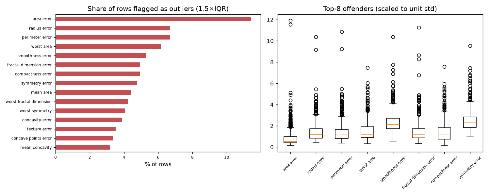

# Day 37 — sklearn `breast_cancer` (569 rows · 30 features)

**Question:** Where are the outliers, and how much do they move the summary statistics?

**Method:** Flagged values outside 1.5×IQR per feature, counted the share of affected rows, and recomputed the worst feature's mean with them removed.

**Insights**
1. **area error** has the most extreme values — 11.4% of rows fall outside 1.5×IQR.
2. 171 of 569 rows (30.1%) are an outlier on at least one feature, so dropping outlier rows wholesale would cost a large slice of the data.
3. Trimming area error's outliers moves its mean by 0.26 std (40.34 → 28.35) — a material shift.

**Next question this raises:** Does a robust scaler beat a standard scaler on this data?

