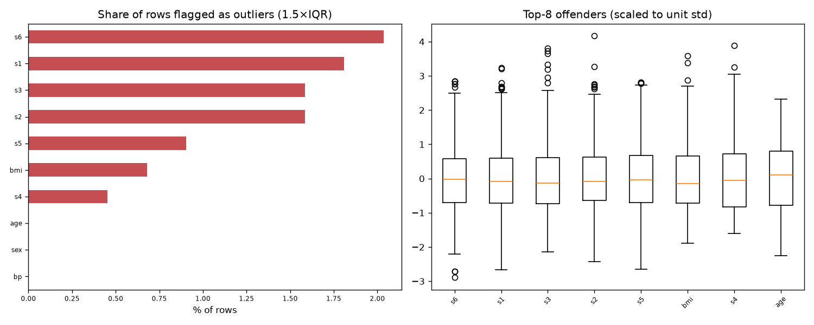

# Day 38 — sklearn `diabetes` (442 rows · 10 features)

**Question:** Where are the outliers, and how much do they move the summary statistics?

**Method:** Flagged values outside 1.5×IQR per feature, counted the share of affected rows, and recomputed the worst feature's mean with them removed.

**Insights**
1. **s6** has the most extreme values — 2.0% of rows fall outside 1.5×IQR.
2. 31 of 442 rows (7.0%) are an outlier on at least one feature, so dropping outlier rows wholesale would cost a large slice of the data.
3. Trimming s6's outliers moves its mean by 0.02 std (0.00 → -0.00) — barely anything.

**Next question this raises:** Does a robust scaler beat a standard scaler on this data?

