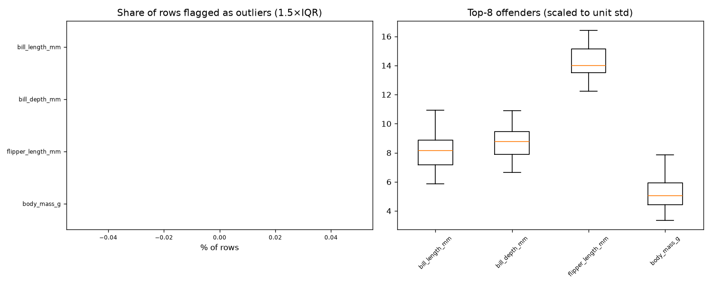

# Day 39 — seaborn `penguins` (344 rows · 6 features)

**Question:** Where are the outliers, and how much do they move the summary statistics?

**Method:** Flagged values outside 1.5×IQR per feature, counted the share of affected rows, and recomputed the worst feature's mean with them removed.

**Insights**
1. **bill_length_mm** has the most extreme values — 0.0% of rows fall outside 1.5×IQR.
2. 0 of 342 rows (0.0%) are an outlier on at least one feature, so dropping outlier rows wholesale would cost a large slice of the data.
3. Trimming bill_length_mm's outliers moves its mean by 0.00 std (43.92 → 43.92) — barely anything.

**Next question this raises:** Does a robust scaler beat a standard scaler on this data?

