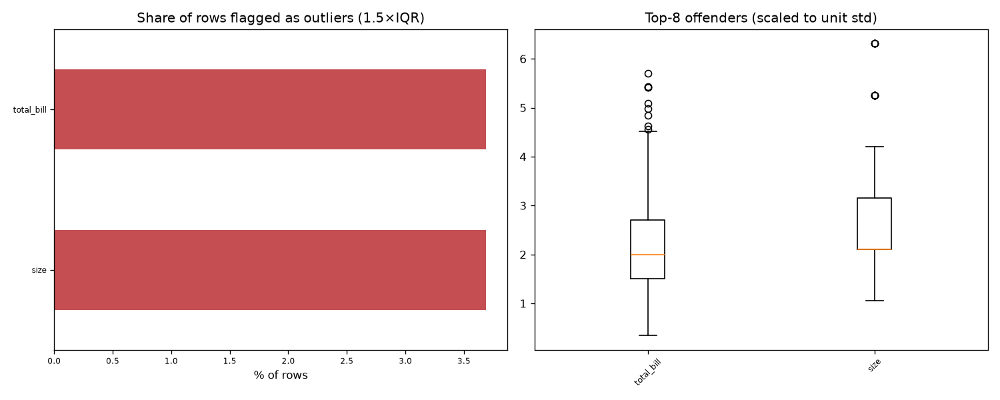

# Day 40 — seaborn `tips` (244 rows · 6 features)

**Question:** Where are the outliers, and how much do they move the summary statistics?

**Method:** Flagged values outside 1.5×IQR per feature, counted the share of affected rows, and recomputed the worst feature's mean with them removed.

**Insights**
1. **total_bill** has the most extreme values — 3.7% of rows fall outside 1.5×IQR.
2. 16 of 244 rows (6.6%) are an outlier on at least one feature, so dropping outlier rows wholesale would cost a large slice of the data.
3. Trimming total_bill's outliers moves its mean by 0.11 std (19.79 → 18.80) — a material shift.

**Next question this raises:** Does a robust scaler beat a standard scaler on this data?

