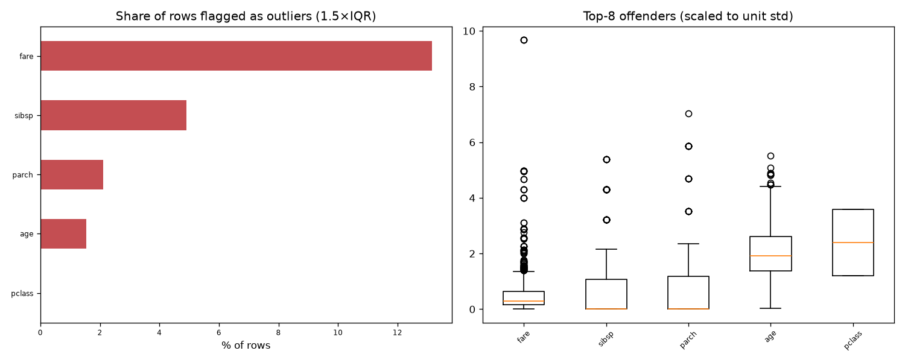

# Day 41 — seaborn `titanic` (891 rows · 10 features)

**Question:** Where are the outliers, and how much do they move the summary statistics?

**Method:** Flagged values outside 1.5×IQR per feature, counted the share of affected rows, and recomputed the worst feature's mean with them removed.

**Insights**
1. **fare** has the most extreme values — 13.2% of rows fall outside 1.5×IQR.
2. 151 of 714 rows (21.1%) are an outlier on at least one feature, so dropping outlier rows wholesale would cost a large slice of the data.
3. Trimming fare's outliers moves its mean by 0.29 std (34.69 → 19.28) — a material shift.

**Next question this raises:** Does a robust scaler beat a standard scaler on this data?

