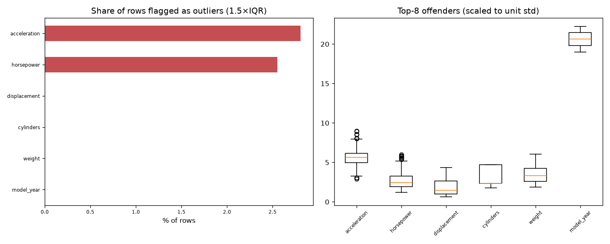

# Day 42 — seaborn `mpg` (398 rows · 8 features)

**Question:** Where are the outliers, and how much do they move the summary statistics?

**Method:** Flagged values outside 1.5×IQR per feature, counted the share of affected rows, and recomputed the worst feature's mean with them removed.

**Insights**
1. **acceleration** has the most extreme values — 2.8% of rows fall outside 1.5×IQR.
2. 20 of 392 rows (5.1%) are an outlier on at least one feature, so dropping outlier rows wholesale would cost a large slice of the data.
3. Trimming acceleration's outliers moves its mean by 0.04 std (15.54 → 15.44) — barely anything.

**Next question this raises:** Does a robust scaler beat a standard scaler on this data?

