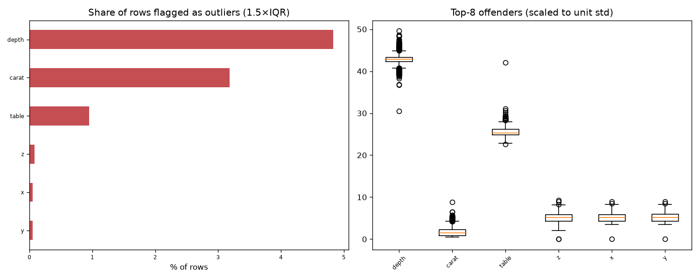

# Day 43 — seaborn `diamonds` (6,000 rows · 9 features)

**Question:** Where are the outliers, and how much do they move the summary statistics?

**Method:** Flagged values outside 1.5×IQR per feature, counted the share of affected rows, and recomputed the worst feature's mean with them removed.

**Insights**
1. **depth** has the most extreme values — 4.8% of rows fall outside 1.5×IQR.
2. 492 of 6000 rows (8.2%) are an outlier on at least one feature, so dropping outlier rows wholesale would cost a large slice of the data.
3. Trimming depth's outliers moves its mean by 0.03 std (61.71 → 61.76) — barely anything.

**Next question this raises:** Does a robust scaler beat a standard scaler on this data?

