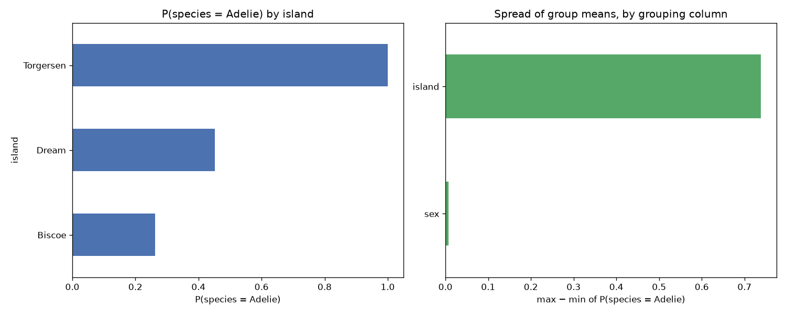

# Day 44 — seaborn `penguins` (344 rows · 6 features)

**Question:** Which categorical column splits the target most?

**Method:** Grouped by each low-cardinality category column, computed P(species = Adelie) per group, and compared the spread of group means across columns.

**Insights**
1. **island** splits the target hardest: P(species = Adelie) runs from 0.262 (**Biscoe**) to 1.000 (**Torgersen**).
2. That is a 0.738 gap against an overall level of 0.442 — 167% of the baseline.
3. The weakest grouping (**sex**) spans only 0.008, so not every category column is worth encoding.

**Next question this raises:** Do those group gaps survive once the numeric features are controlled for?

