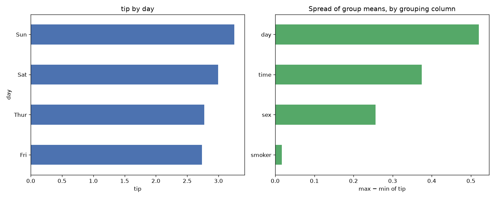

# Day 45 — seaborn `tips` (244 rows · 6 features)

**Question:** Which categorical column splits the target most?

**Method:** Grouped by each low-cardinality category column, computed tip per group, and compared the spread of group means across columns.

**Insights**
1. **day** splits the target hardest: tip runs from 2.735 (**Fri**) to 3.255 (**Sun**).
2. That is a 0.520 gap against an overall level of 2.998 — 17% of the baseline.
3. The weakest grouping (**smoker**) spans only 0.017, so not every category column is worth encoding.

**Next question this raises:** Do those group gaps survive once the numeric features are controlled for?

