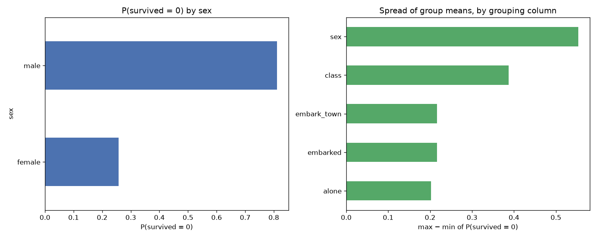

# Day 46 — seaborn `titanic` (891 rows · 10 features)

**Question:** Which categorical column splits the target most?

**Method:** Grouped by each low-cardinality category column, computed P(survived = 0) per group, and compared the spread of group means across columns.

**Insights**
1. **sex** splits the target hardest: P(survived = 0) runs from 0.258 (**female**) to 0.811 (**male**).
2. That is a 0.553 gap against an overall level of 0.616 — 90% of the baseline.
3. The weakest grouping (**alone**) spans only 0.202, so not every category column is worth encoding.

**Next question this raises:** Do those group gaps survive once the numeric features are controlled for?

