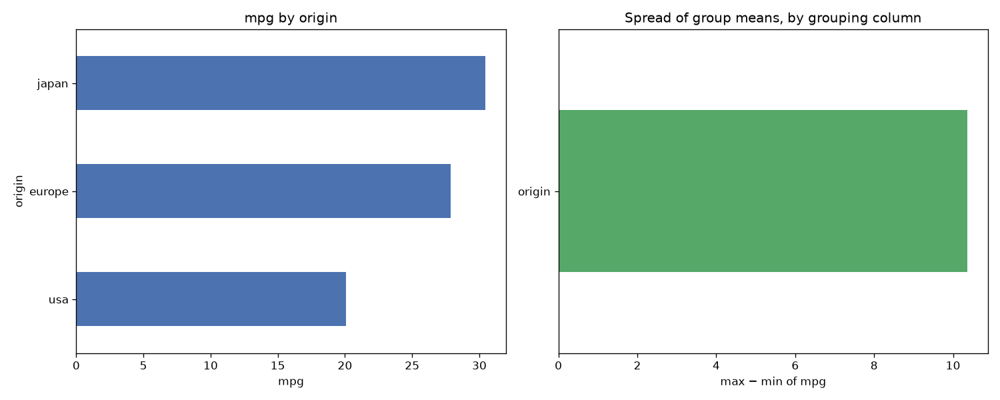

# Day 47 — seaborn `mpg` (398 rows · 8 features)

**Question:** Which categorical column splits the target most?

**Method:** Grouped by each low-cardinality category column, computed mpg per group, and compared the spread of group means across columns.

**Insights**
1. **origin** splits the target hardest: mpg runs from 20.084 (**usa**) to 30.451 (**japan**).
2. That is a 10.367 gap against an overall level of 23.515 — 44% of the baseline.
3. The weakest grouping (**origin**) spans only 10.367, so not every category column is worth encoding.

**Next question this raises:** Do those group gaps survive once the numeric features are controlled for?

