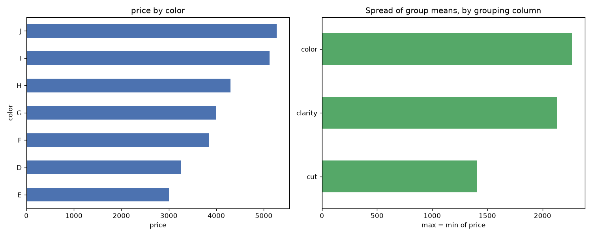

# Day 48 — seaborn `diamonds` (6,000 rows · 9 features)

**Question:** Which categorical column splits the target most?

**Method:** Grouped by each low-cardinality category column, computed price per group, and compared the spread of group means across columns.

**Insights**
1. **color** splits the target hardest: price runs from 3004.274 (**E**) to 5275.220 (**J**).
2. That is a 2270.946 gap against an overall level of 3920.813 — 58% of the baseline.
3. The weakest grouping (**cut**) spans only 1404.492, so not every category column is worth encoding.

**Next question this raises:** Do those group gaps survive once the numeric features are controlled for?

