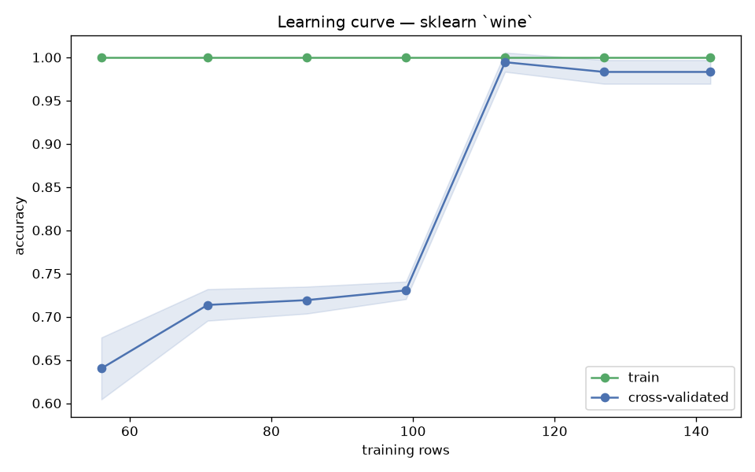

# Day 49 — sklearn `wine` (178 rows · 13 features)

**Question:** How much of the data does the model actually need?

**Method:** Ran a learning curve for a scaled linear model over 10 training-set sizes with 5-fold CV, tracking train and cross-validated scores.

**Insights**
1. CV accuracy reaches 0.983 at the full 142 training rows, up from nan at 14 rows.
2. **113 rows (80% of the data) already get within 2% of the final score** — the curve is flat well before the data runs out.
3. Train sits 0.017 above CV at full size, so the model is not memorising — more data would not help much.

**Next question this raises:** Does a non-linear model keep improving where the linear one flattens out?

